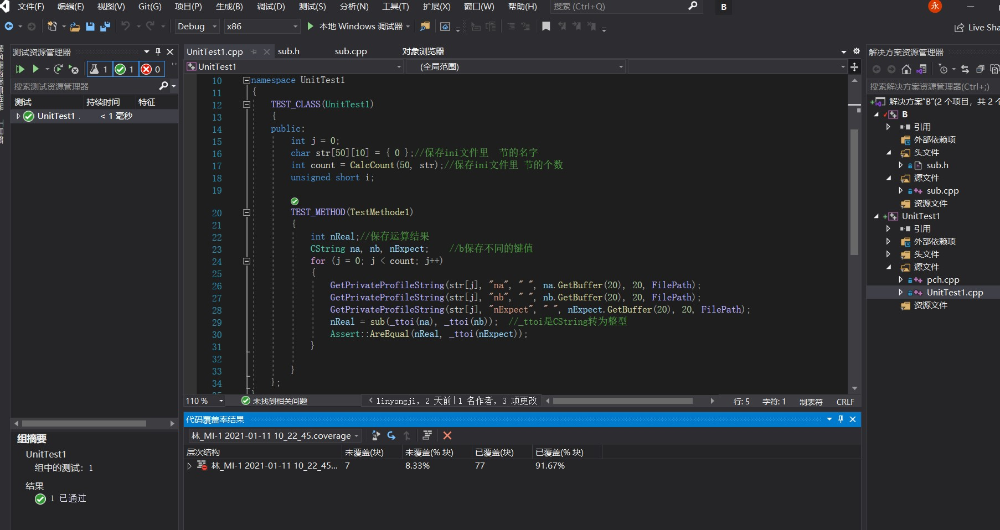

# sub函数说明文档    
## 一、工程说明  
- 本工程的配置类型是一个动态库文件，目的是生成一个可被其他工程调用动态库，动态库的函数功能是：输入两个int类型的数，返回两数之差。
## 二、头文件 sub.h  ，放的是sub函数声明
```C  
#ifndef _SUB_H_
#define _SUB_H_
#ifdef sub_EXPORTS
#define sub_EXPORTS _declspec(dllexport)
#else
#define sub_EXPORTS _declspec(dllimport)
#endif
/*
**函数名： sub
**参数：int ，int
**返回值：int
**函数功能：传入两个int类型的参数，对其进行减法运算并返回差值。
*/
sub_EXPORTS int sub(int x, int y);

#endif
```
## 三、源文件 sub.cpp  ，放的是sub函数的另一
```C
#include"sub.h"
int sub(int x, int y)
{
	return x - y;
}
```
## 四、单元测试   
- 手动创建ini文件并添加测试样例，之后在单元测试的源文件里对ini文件进行读取解析 ，完成以后获取单元测试的结果，保证代码覆盖率在80%以上。其中对ini文件的读取另封装了函数，见下面的源码。  
1. ini文件内容  exl.ini  
  ```
    [TestMethod1]   #测试样例1
    na=10           #函数第一个入数
    nb=4            #函数第二个入参
    nExpect=6      #两个入参相减的正确结果
	[TestMethod2]
	na=7
	nb=3
	nExpect=4
  ```   
  2. 读取ini文件的函数   int CalcCount(int n, char(*str)[10])
```C
/*
**函数功能：获取一个ini文件里有多少个节，并通过二维指针数组将节名带出来。
* 函数名：CalcCount（）
* 入参：int n              --------节的个数
*       char (*str)[10]    --------二维数组指针，10是节名的长度，可以根据需求修改
*返回值：int               --------返回节的个数
*/
int CalcCount(int n, char(*str)[10])
int CalcCount(int n, char(*str)[10])
{
	TCHAR   chSectionNames[2048] = { 0 };//定义一个数组，保存读取节的名字
	char* pSectionName; //保存找到的某个节名字符串的首地址
	int i = 0;          //i指向数组chSectionNames的某个位置，从0开始，顺序后移
	int j = 0;      //j用来保存下一个节名字符串的首地址相对于当前i的位置偏移量
	int k = 0;      //临时变量，用于给str数组赋值
	int m = 0;      //临时变量，用于给str数组赋值
	int count = 0;      //统计节的个数    
	GetPrivateProfileSectionNames(chSectionNames, 2048, "..//ex1.ini");//获取文件中的节名，每个节名以"\0"分割，保存在chSectionNames中
																	   //要加头文件
	for (i = 0; i < 2048; i++, j++)//对chSectionName中保存的内容进行拆分
	{
		if (chSectionNames[0] == '\0')//如果第一个字符就是0，则说明ini中一个节也没有，
		{
			break;
		}
		if (chSectionNames[i] == '\0')
		{
			count++;
			pSectionName = &chSectionNames[i - j]; //找到一个0，则说明从这个字符往前，减掉j个偏移量，
												   //就是一个节名的首地址 
			j = -1;                               //找到一个节名后，j的值要还原，以统计下一个节名地址的偏移量
												  //赋成-1是因为节名字符串的最后一个字符0是终止符，不能作为节名
			for (m = 0; m <= strlen(pSectionName); m++)//把找到的节名保存到str中
			{
				str[k][m] = *(pSectionName + m);
			}
			k++;//变量自加，用来保存下一个节名
			//在获取节名的时候可以获取该节中键的值，前提是我们知道该节中有哪些键。
			if (chSectionNames[i + 1] == 0)
			{
				break;      //当两个相邻的字符都是0时，则所有的节名都已找到，循环终止
			}
		}
	}
	return count;//返回节名的个数
}
```  
3. 单元测试源码  UNITest1.cpp
```C
#include "pch.h"
#include "CppUnitTest.h"
#include<Windows.h>
#include <atlstr.h>
#include "../B/sub.h"
#define FilePath "../ex1.ini"
using namespace Microsoft::VisualStudio::CppUnitTestFramework;

namespace UnitTest1
{
	TEST_CLASS(UnitTest1)
	{
	public:
		int j = 0;//循环变量，用来访问ini文件中的 节
		char str[50][10] = { 0 };//存放ini文件里  节的名字
		int count = CalcCount(50, str);//保存ini文件里 节的个数
		TEST_METHOD(TestMethode1)
		{
			int nReal;//保存运算结果
			CString na, nb, nExpect;	//保存测试样例中的键值
			for (j = 0; j < count; j++)//遍历读取测试样例
			{
				GetPrivateProfileString(str[j], "na", " ", na.GetBuffer(20), 20, FilePath);//读取第一个参数，保存在na里
				GetPrivateProfileString(str[j], "nb", " ", nb.GetBuffer(20), 20, FilePath);//读取第二个参数，保存在nb里
				GetPrivateProfileString(str[j], "nExpect", " ", nExpect.GetBuffer(20), 20, FilePath);//读取正确的值，保存在nExpect里
				nReal = sub(_ttoi(na), _ttoi(nb));	//_ttoi是CString转为整型，把运算结果给nReal
				Assert::AreEqual(nReal, _ttoi(nExpect));//对比运算结果和正确结果
			}

		}
	};
}
```
4. 附加测试结果  

